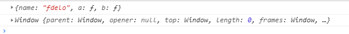

话不多说，全面整理一下各个状态下的this指向，并对原理做一些分析
### 1.普通函数
```javascript
let a = function() {
	console.log(this)
}
let b=()=>{
	console.log(this)
}
a(),b()
```
全局作用域调用的，所以this指向调用该方法的对象，既window。前者严格模式下会指向undefined，后者都是window

### 2.作为对象方法
```javascript
let c = {
	name: 'fdelo',
	a: function(){
	console.log(this)
	},
	b:()=>{
	console.log(this)
	}
}
c.a() 
c.b() 
```


第一个： c调用的指向c
第二个： 这里还是window,因为箭头函数是没有原型的，箭头函数的指向在定义的时候继承外层第一个普通函数的this

```javascript
let d = {
    name: 'fdelo',
    a: function(){
    	console.log(this) // {name: "fdelo", a: ƒ}
    	return () => {
		console.log(this) // {name: "fdelo", a: ƒ}
	}
  }
}
d.a()();
```
这个例子和上面的例子不一样的地方在于将箭头放进了对象普通函数内，这里的this为什么就是d对象了呢。通过这两个例子我们能更好的理解了什么叫做执行上下文。
c对象里的箭头函数最近的function是window，但是d对象里的箭头函数最近的function是a，而a的执行上下文的this是d,所以这里是d。
1.箭头函数的this是在函数定义时候就确定下来，而不是在调用的时候确定的
2.箭头函数中的this指向父级作用域的执行上下文（记住：因为javascript中除了全局作用域，其他作用域都是由函数创建出来的，所以如果想确定this的指向，则找到离箭头函数最近的function，与该function平级的执行上下文中的this即是箭头函数中的this）
3.this的指向看的是作用域！作用域!作用域！
4.箭头函数无法使用apply、call和bind方法改变this指向，因为其this值在函数定义的时候就被确定下来。箭头函数并没有自己的执行上下，它的this是根据父函数走的，所以箭头函数使用apply(this)这种可能会丢失第一个参数.

### 3.作为构造器使用
```javascript
function e(){
	this.name = 'fdelo'
	this.age='18'
	this.say=function(){
		console.log(this) 
	}
	 this.hay=()=>{
        console.log(this)
    }
}
let f = new e();
f.say(); // this指向f  e {name: "fdelo", age: "18", say: ƒ} 
f.hay() ;// this指向f  e {name: "fdelo", age: "18", say: ƒ} 
```
用new时构造函数内部的this会指向新的实例,至于为什么用new创建的实例this会指向它就要来分析一下new 一个操作函数发生了什么
我们知道，new一个构造器分为三步，创建一个空对象，把它的引用赋给this,继承函数的原型；
通过this将属性和方法添加到这个对象
最后返回this指向的新对象，也就是这里的实例，大概过程类似于：

### new一个构造器的过程
```javascript
let Parent = function (name, age) {
    1.创建一个新对象，赋予this，这一步是隐性的，
    let this = {};
    2.给this指向的对象赋予构造属性
    this.name = name;
    this.age = age;
    3.如果没有手动返回对象，则默认返回this指向的这个对象，也是隐性的
    // return this;
};
const child = new Parent();
```
但到这里，我们能看到构造器的属性塞给了实例，具体原型上的属性又是怎么给实例的呢。网上一个解释：
 •以构造器的prototype属性为原型，创建新对象；
 • 将this(也就是上一句中的新对象)和调用参数传给构造器，执行；
 • 如果构造器没有手动返回对象，则返回第一步创建的新对象，如果有，则舍弃掉第一步创建的新对象，返回手动return的对象。

构造器函数
```javascript
let Parent = function (name, age) {
    this.name = name;
    this.age = age;
};
Parent.prototype.sayName = function () {
    console.log(this.name);
};
//自己定义的new方法
let newMethod = function (Parent, ...rest) {
    // 1.以构造器的prototype属性为原型，创建新对象；
    let child = Object.create(Parent.prototype);
    // 2.将this和调用参数传给构造器执行
    let result = Parent.apply(child, rest); // 这样就实现了既继承构造器属性，又继承了它的原型！！！
    // 3.如果构造器没有手动返回对象，则返回第一步的对象
    return typeof result  === 'object' ? result : child;
};
//创建实例，将构造函数Parent与形参作为参数传入
const child = newMethod(Parent, 'echo', 26);
child.sayName() //'echo';

//最后检验，与使用new的效果相同
child instanceof Parent//true
child.hasOwnProperty('name')//true
child.hasOwnProperty('age')//true
child.hasOwnProperty('sayName')//false
```